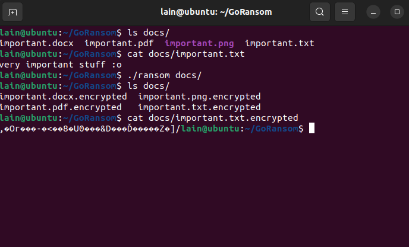
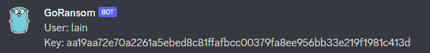

# GoRansom
"Ransomware" with Go's speed & webhook key extraction.

## Showcase

### Webhook

## Usage

### Step 1
If you want to extract the key, obfuscate your Discord Webhook with the amazing [mumbojumbo](https://github.com/jeromer/mumbojumbo).

Replace the content of `imports/hook.go` with your mumbojumbo-encrypted string.

You can also pass the Webhook string directly, but that can easily be extracted:  
`string ransom | grep discord.com`

### Step 2

If you don't want to pass the path to be encrypted via args you can change the `folder` variable to your path, eg. `folder := "docs/"`.  
Then remove/comment out the arg check above that.

Compile `ransom.go` with `go build ransom.go`

### Step 3

If you passed the path in the variable directly you can simply execute the binary:  
`./ransom`

Else you need to pass the folder to be encrypted:  
`./ransom docs/`

### Decryption

Compile the `decrypter/decrypt.go` with `go build decrypter.go`,  
put the binary in the encrypted folder, and pass the key as an arg, eg:  
`./decrypt xxxxxxxxxxxxxxxxxxxxxxxxxxxxxxxxxxxxxxxxxx`

All files in the same folder should now be decrypted and back to normal.

## Todo
- [ ] Add telegram Bot support
- [ ] Use goroutines for faster encrypting?